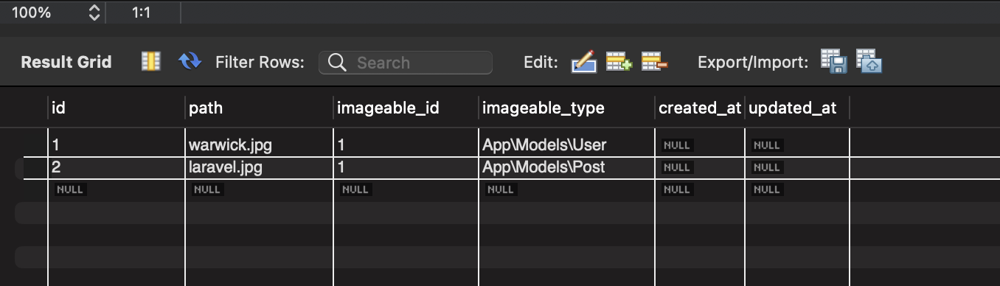

---
<a name="Back_To_Top"></a> Top
---

- ### [One to one relationship](#One_to_one_relationship)
- ### [The inverse relation](#The_inverse_relation)
- ### [One to many relationship](#One_to_many_relationship)
- ### [Many to many relations](#Many_to_many_relations)
- ### [Querying intermediate table](#Querying_intermediate_table)
- ### [Has many through relation](#Has_many_through_relation)
- ### [Polymorphic relation](#Polymorphic_relation)
- ### [Polymorphic relation - the inverse](#Polymorphic_relation_the_inverse)
- ### [Polymorphic relation many to many](#Polymorphic_relation_many_to_many)

---

## <a name="One_to_one_relationship"></a>One to one relationship

Relationships are functions that relate tables to tables. For example in a One to One relationship we could say that a user has one post. Or in a One to Many the user has many posts. 

To set this up we need to create a foreign key and also write a function in the parent model. 

*migrations/create_posts_table.php*
```php
    public function up()
    {
        Schema::create('posts', function (Blueprint $table) {
            $table->id();
            $table->integer('user_id')->unsigned(); // Add user_id column with unsigned() for only positive numbers
            $table->string('title');
            $table->string('content');
            $table->timestamps();
        });
    }
```

In the parent model we write the function that will run the query.

*models/user*
```php
    public function post(){
        return $this->hasOne('App\Models\Post');
    }
```

This is going to go to the posts table because we gave it a name space.

It's got to look for the column `user_id` automatically. This is by default OK by default is going to do it.

Now if you want to specify a different column you put it as a second parameter here coma `the_user_id`, for example.

If the `id` field was named differently you can also specify its name as a third parameter.

*routes/web.php*
```php
use App\Models\User;

Route::get('/user/{id}/post', function($id){
    return User::find($id)->post;
});
```

---

- [Top](#Back_To_Top)

---

## <a name="The_inverse_relation"></a>The inverse relation

Inversely, we can also find the user whos post it is.

*routes/web.php*
```php
    Route::get('/post/{id}/user', function($id){
        return Post::find($id)->user->name;
    });
```

*models/post*
```php
    public function user(){
        return $this->belongsTo('App\Models\User');
    }
```

---

- [Top](#Back_To_Top)

---

## <a name="One_to_many_relationship"></a>One to many relationship

With a one to many relationship we can find all the posts of a particular user.

*routes/web.php*
```php
    Route::get('/user/{id}/posts', function($id){
        $user = User::find($id);

        foreach($user->posts as $post) {
            echo $post->title . "<br>";
        }
    });
```

*models/user*
```php
    public function posts(){
        return $this->hasMany('App\Models\Post');
    }
```

---

- [Top](#Back_To_Top)

---


## <a name="Many_to_many_relations"></a>Many to many relations

A pivot table is a lookup table that can be used to relate 2 other tables. Laravel has a lot of conventions for when working with a pivot table. If we follow those conventions we don't need to make a lot of customizations.

We're setting up a relationship between the `users` table and the `roles` table

*Step 1:* Create the `roles` table (`users` table already exists)

`php artisan make:model Role -m`

*migrations/create_roles_table.php*
```php
    public function up()
        {
            Schema::create('roles', function (Blueprint $table) {
                $table->id();
                $table->string('name'); // add name column
                $table->timestamps();
            });
        }
```

*Step 2* Create users roles table

`php artisan make:migration create_users_roles_table --create=role_user`

*migrations/create_users_roles_table.php*

```php
    public function up()
    {
        Schema::create('role_user', function (Blueprint $table) {
            $table->id();
            $table->integer('user_id'); //add user_id foreign key
            $table->integer('role_id'); //add role_id foreign key
            $table->timestamps();
        });
    }
```

### In the model you can define the table name as well as the foreign keys if you didn't follow the Laravel convention of singular and all lower case. 

*models/user*
```php
    public function roles(){
        // return $this->belongsToMany('App\Models\Role', 'user_roles', 'role_id', 'user_id');
        return $this->belongsToMany('App\Models\Role');
    }
```

*routes/web.php*
```php
    Route::get('/user/{id}/role', function($id){

        $user = User::find($id)->roles()->orderBy('id', 'desc')->get();

        return $user;

        // $user = User::find($id);

        // foreach($user->roles as $role) {
        //     echo $role->name . "<br>";
        // }
    });
```

---

- [Top](#Back_To_Top)

---


## <a name="Querying_intermediate_table"></a>Querying intermediate table

*models/user*
```php
    public function roles(){
        return $this->belongsToMany('App\Models\Role')->withPivot('created_at');
    }
```

*routes/web.php*
```php
    Route::get('user/pivot', function(){
        $user = User::find(1);

        foreach($user->roles as $role){
            return $role->pivot->created_at;
        }
    });
```

---

- [Top](#Back_To_Top)

---


## <a name="Has_many_through_relation"></a>Has many through relation

This relation provides a convenient shortcut for accessing distant relationships via an intermediary relation. For example we could have a users table, a posts table and a countries table. We can determine which country the user is from via the posts table. 

We need to have a countries table and we also need to have a column in the users table for country_id

`php artisan make:model Country -m`

*migrations/create_countries_table*
```php
    public function up()
    {
        Schema::create('countries', function (Blueprint $table) {
            $table->id();
            $table->string('name');
            $table->timestamps();
        });
    }
```

`php artisan make:migration add_country_id_column_to_users --table=users`

*migrations/add_country_id_column_to_users.php*
```php
    public function up()
    {
        Schema::table('users', function (Blueprint $table) {
            $table->integer('country_id');
        });
    }
```

`php artisan migrate`

*models/country*
```php
    class Country extends Model
    {
        use HasFactory;

        public function posts(){
            return $this->hasManyThrough('App\Post', 'App\User');
        }
    }
```

*routes/web.php*
```php
Route::get('/user/country', function(){

    $country = Country::find(1);

    foreach($country->posts as $post){
        return $post->title;
    }

});
```


---

- [Top](#Back_To_Top)

---


## <a name="Polymorphic_relation"></a>Polymorphic relation

Polymorphic relations allow a model to belong to more than one other model in a single association. We could have a users and a post table and they both could be related to one other table called photos. The photos table might say that this belongs to the post model with an id of 1 and this belongs to the user model with an id of 2. 

`php artisan make:model Photo -m`

```php
    public function up()
    {
        Schema::create('photos', function (Blueprint $table) {
            $table->id();
            $table->string('path');
            $table->integer('imageable_id');
            $table->string('imageable_type');
            $table->timestamps();
        });
    }
```



*models/photo*
```php
    class Photo extends Model
    {
        use HasFactory;

        public function imageable(){
            return $this->morphTo();
        }
    }
```

*models/user*
```php
    public function photos(){
        return $this->morphMany('App\Models\Photo', 'imageable');
    }
```

*models/post*
```php
    public function photos(){
        return $this->morphMany('App\Models\Photo', 'imageable');
    }
```

*routes/web.php*
```php
    Route::get('user/photos', function(){
        $user = User::find(1);

        foreach($user->photos as $photo){
            echo $photo->path . '<br>';
        }
    });
```

---

- [Top](#Back_To_Top)

---

## <a name="Polymorphic_relation_the_inverse"></a>Polymorphic relation - the inverse

We can also find the inverse associations of a polymorphic relationship.

*models/photo*
```php
    class Photo extends Model
    {
        use HasFactory;

        public function imageable(){
            return $this->morphTo();
        }
    }
```

*routes/web.php*
```php
Route::get('/photo/{id}/association', function($id) {
    $photo = Photo::findOrFail($id);
    return $photo->imageable;
});
```

---

- [Top](#Back_To_Top)

---


## <a name="Polymorphic_relation_many_to_many"></a>Polymorphic relation many to many

Many to many relationships for polymorphic relations share a single list of unique records among the rest of the other tables. A Post and Video table can both share Tags. 

`php artisan make:model Video -m`

*migrations*
```php
    public function up()
    {
        Schema::create('videos', function (Blueprint $table) {
            $table->id();
            $table->string('name');
            $table->timestamps();
        });
    }
```

`php artisan make:model Tag -m`

*migrations*
```php
    public function up()
    {
        Schema::create('tags', function (Blueprint $table) {
            $table->id();
            $table->string('name');
            $table->timestamps();
        });
    }
```

`php artisan make:model Taggable -m`

*migrations*
```php
    public function up()
    {
        Schema::create('taggables', function (Blueprint $table) {
            $table->id();
            $table->integer('tag_id');
            $table->integer('taggable_id');
            $table->integer('taggable_type');
            $table->timestamps();
        });
    }
```

*App\Models\Post*
```php
    public function tags(){
        return $this->morphToMany('App\Models\Tag', 'taggable');
    }
```

*App\Models\Tag*
```php
class Tag extends Model
{
    use HasFactory;

    public function posts(){
        return $this->morphedByMany('App\Models\Post', 'taggable');
    }

    public function videos(){
        return $this->morphedByMany('App\Models\Video', 'taggable');
    }
}
```


---

- [Top](#Back_To_Top)

---

- ### [1 TEMPLATE](#1_TEMPLATE)

## <a name="1_TEMPLATE"></a>1 TEMPLATE

---

- [Top](#Back_To_Top)

---

