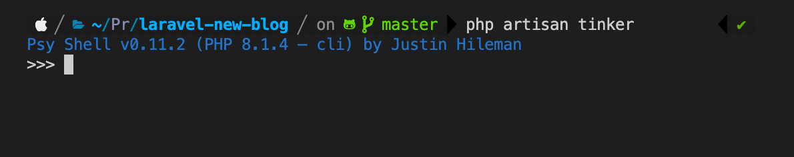
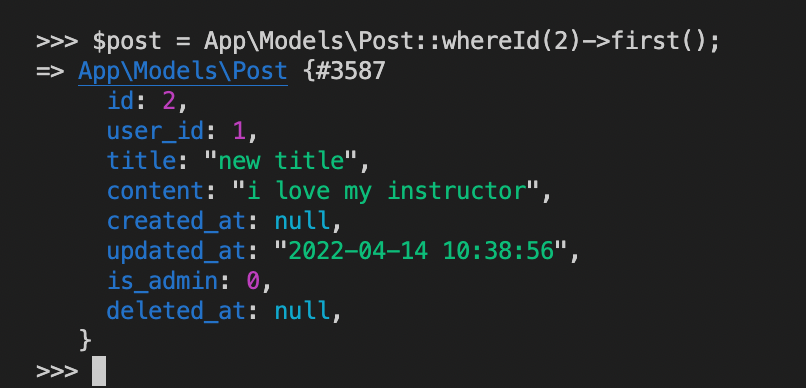
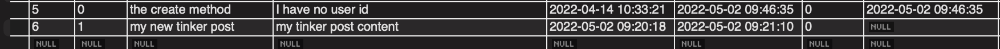

---
 Top
---

- ### [Creating data with tinker](#Creating_data_with_tinker)
- ### [Finding records and using constraints](#Finding_records_and_using_constraints)
- ### [Updating and deleting](#Updating_and_deleting)
- ### [Playing around with relations](#Playing_around_with_relations)
---

## Creating data with tinker

Tinker is a command line tool that can be used to perform all the CRUD operations on our database. 

`php artisan tinker`

Create a post

`$post = App\Models\Post::create(['title'=>'Php post from tinker', 'content'=>'Php content from tinker']);`

Create a post on the fly 

`$post = new App\Models\Post;`

`$post->title = 'My new tinker post';`

`$post->content = 'This is some content';`

`$post->save();`

Exit tinker

`exit`

---

- [Top](#Back_To_Top)

---

## Finding records and using constraints

`$post = App\Models\Post::find(2);`

With constraints...

`$post = App\Models\Post::where('id', 2)->first();`

`$post = App\Models\Post::whereId(2)->first();`

---

- [Top](#Back_To_Top)

---

## Updating and deleting

Updating

`$post = App\Models\Post::where('id', 5)->first();`

`$post->content = 'Updating post';`

`$post->save();`

Deleting

The `delete()` method performs a soft delete which adds a date

`$post = App\Models\Post::whereId(5)->first();`

`$post->delete();`

Delete the soft deleted item

`$post=App\Models\Post::onlyTrashed()->first();`

`$post->forceDelete();`

---

- [Top](#Back_To_Top)

---

## Playing around with relations

Tinker can display data from relationships as well 

`$user = App\Models\User::find(1);`

`$user->posts;`

`$user->photos;`

---

- [Top](#Back_To_Top)

---

